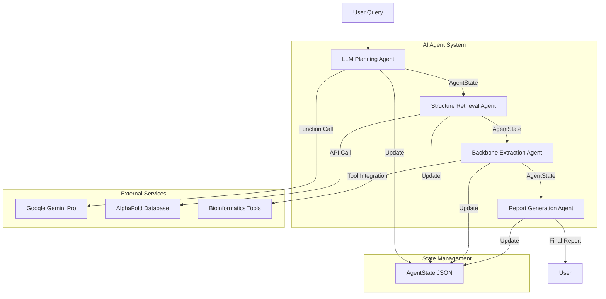

# PlugPEP: AI-Powered Protein Binder Design Workflow

PlugPEP is an advanced AI-driven workflow for designing protein binders based on natural language queries. It leverages a sophisticated multi-stage AI agent architecture with Google's Gemini Pro model, AlphaFold database integration, and state-of-the-art prompt engineering techniques.

## Author

**Foad Nazari**
*AI Researcher*
[GitHub](https://github.com/foadnazari) | [LinkedIn](https://www.linkedin.com/in/foadnazari/)

**Sara Baghalian**
*AI Researcher*
[GitHub](https://github.com/SaraBa87) | [LinkedIn](https://www.linkedin.com/in/sara-baghalian)

## Interactive Demo

You can try out PlugPEP in our interactive Kaggle notebook: [PlugPEP-dev](https://www.kaggle.com/code/fn1985/plugpep-dev)

## Architecture Overview

PlugPEP employs a multi-stage AI agent architecture that processes natural language queries through several specialized stages:

1. **LLM Planning Agent**: Uses Google's Gemini Pro model with advanced prompt engineering to identify target proteins from natural language descriptions
2. **Structure Retrieval Agent**: Interfaces with the AlphaFold database to retrieve high-quality protein structures
3. **Backbone Extraction Agent**: Processes the retrieved structures to extract backbone information
4. **Report Generation Agent**: Synthesizes all information into actionable recommendations

## Advanced Features

### AI Agent Architecture

The workflow is built around a AI agent system that maintains state between stages using a structured JSON object (`AgentState`). This state object is continuously updated as the workflow progresses, ensuring information persistence and context awareness across all stages.

### Prompt Engineering

PlugPEP employs advanced prompt engineering techniques:

- **Few-shot Learning**: The LLM is provided with carefully crafted examples to guide its responses
- **Structured Output Parsing**: Responses are parsed into structured JSON objects for consistent processing
- **Contextual Prompting**: Each stage receives context from previous stages to maintain coherence
- **Domain-Specific Instructions**: Prompts include specialized knowledge about protein functions and structures

### Functional Calling & API Integration

The workflow uses functional calling to interface with external services:

- **AlphaFold Database API**: Direct API calls to retrieve protein structures
- **Google Gemini API**: Function calls to the LLM with structured parameters
- **Bioinformatics Tools**: Integration with specialized tools for protein analysis

## Workflow Diagram

## How It Works

1. **LLM Planning Stage**:
   - User provides a natural language query
   - LLM Planning Agent processes the query using advanced prompt engineering
   - Agent identifies the target protein and its UniProt ID
   - Results are stored in the AgentState

2. **Structure Retrieval Stage**:
   - Structure Retrieval Agent uses the UniProt ID from the AgentState
   - Makes API calls to the AlphaFold database
   - Retrieves PDB and CIF files for the target protein
   - Updates the AgentState with structure information

3. **Backbone Extraction Stage**:
   - Backbone Extraction Agent processes the retrieved structure
   - Extracts backbone atoms using specialized tools
   - Saves the extracted backbone to a PDB file
   - Updates the AgentState with backbone information

4. **Report Generation Stage**:
   - Report Generation Agent synthesizes all information in JSON format
   - Creates a comprehensive report with recommendations
   - Updates the AgentState with the final report

## Example Queries

- "Find a binder for the protein that converts prothrombin to thrombin in blood clotting"
- "Find a binder for a protein that breaks down bacterial cell walls"
- "Find a binder for a protein involved in blood clotting"
- "Find a binder for a protein that regulates blood sugar levels"

## Conclusion

PlugPEP demonstrates the power of combining advanced AI agents, state management, and API integration to create a sophisticated workflow for protein binder design. The multi-stage architecture, advanced prompt engineering, and functional calling capabilities make it a powerful tool for protein research and design.

## License

This project is licensed under the MIT License - see the [LICENSE](LICENSE) file for details.

